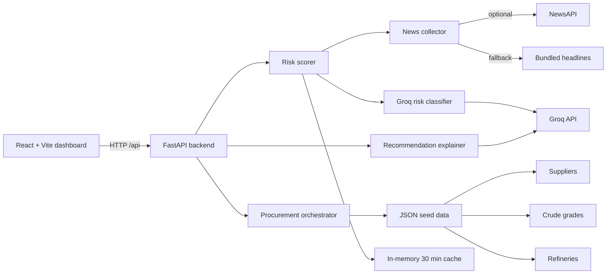

# Energy Resilience AI

Energy Resilience AI is a decision-support dashboard for monitoring India's crude-oil supply resilience. It combines supplier-country risk, maritime chokepoint risk, refinery/crude compatibility, and supplier reliability to help compare procurement options.

The project is designed for analysis and demonstrations. Its scores are transparent, model-assisted indicators—not trading, shipping, or procurement instructions.

## What it does

- Monitors risk across nine supplier countries and five maritime chokepoints.
- Uses oil-related news headlines to estimate current country, route, and global-market risk.
- Calculates a global oil-risk score and shows the drivers behind it.
- Matches crude grades to Indian refinery operating ranges.
- Ranks eligible suppliers for a requested daily crude volume.
- Uses Groq to turn headlines into risk factors and to write concise procurement rationales.
- Keeps working without external keys by using bundled example headlines and neutral AI-risk values.

## Architecture



### Main components

| Area | Technology | Responsibility |
| --- | --- | --- |
| `frontend/` | React, Vite, Tailwind | Dashboard pages, charts, navigation, and API requests. |
| `backend/app/main.py` | FastAPI | HTTP API, CORS configuration, and endpoint routing. |
| `backend/app/services/risk_scorer.py` | Python | Live-risk caching and country, route, and global score calculations. |
| `backend/app/collectors/news_collector.py` | Python, NewsAPI | Headline collection, relevance filtering, and deterministic fallback headlines. |
| `backend/app/services/ai_classifier.py` | Groq | Converts a group of headlines into a 0–1 risk factor. |
| `backend/app/services/procurement.py` | Python | Compatibility scoring and supplier recommendation ranking. |
| `backend/app/services/explainer.py` | Groq | Produces a plain-language rationale for each recommendation. |
| `data/seeds/` | JSON | Runtime catalogue of suppliers, crude grades, refineries, and chokepoints. |
| `docker-compose.yml` | Docker Compose | Optional MongoDB, Neo4j, Redis, and Qdrant services for seed/future integrations. |

## How the project works

### 1. Dashboard requests data

The React app reads `VITE_API_URL` and calls the FastAPI service. Its routes are:

| Dashboard route | Purpose | Primary backend data |
| --- | --- | --- |
| `/` | Overview | Global score, supplier mix, and key risk indicators. |
| `/countries` | Supplier Countries | Country-level risk and supplier context. |
| `/routes` | Shipping Routes | Chokepoint and route risk. |
| `/india-impact` | India Impact | Refinery and domestic impact context. |
| `/recommendations` | Procurement | On-demand ranked sourcing recommendations. |

The Procurement page only calls the explanatory recommendation endpoint after **Generate** is selected.

### 2. The backend refreshes risk data

On the first risk request, after 30 minutes, or when `POST /api/risk/refresh` is called, the risk scorer refreshes three groups of data:

1. Supplier-country headlines for Saudi Arabia, UAE, Kuwait, Qatar, Iran, Russia, Nigeria, Brazil, and the United States.
2. Shipping headlines for Hormuz, Bab-el-Mandeb, Suez, Malacca, and Cape of Good Hope.
3. Global headlines for OPEC stability and Brent-price volatility.

If `NEWSAPI_KEY` is configured, the collector queries NewsAPI and filters headlines for topic and oil-supply relevance. If the key is absent, NewsAPI fails, or a query has no useful results, it uses the bundled fallback headlines. This means the dashboard remains usable offline, although it is not then showing live news.

The refreshed 0–1 factors are stored in the backend process's in-memory cache for 30 minutes. Restarting the backend clears this cache; it is not shared across multiple backend instances.

### 3. Groq converts headlines into risk factors

When `GROQ_API_KEY` is available, the classifier sends each topic's headlines to Groq and requests a single decimal score from `0.0` (calm) to `1.0` (severe). The current classifier model is configured in `ai_classifier.py`.

If Groq is not configured or an AI request fails, the risk path falls back to the neutral value `0.3`. This is intentional graceful degradation; it is not a confirmation that real-world risk is neutral.

`GROQ_API_KEY` is the documented configuration name. The backend also accepts the older mixed-case spelling `Groq_API_KEY` for compatibility, but new `.env` files should use the uppercase name.

### 4. Scores are calculated

Country risk begins with a static baseline and adds the live factor:

```text
country risk = min(100, country baseline + (live factor × 20))
```

Route risk averages the risk contribution of every chokepoint on the route:

```text
route risk = average(live route factor × chokepoint criticality × 100)
```

The global score combines the average country and route factors with OPEC stability and Brent volatility:

```text
global risk = 35% route risk
            + 30% country risk
            + 20% (1 - OPEC stability)
            + 15% Brent volatility
```

All displayed scores are capped at 100. The API also supplies confidence values and driver labels; these are application-defined metadata, not statistically calibrated confidence intervals.

### 5. Procurement options are ranked

The procurement service loads the tracked seed files at backend startup:

- `suppliers.json` supplies supplier country, reliability, and sanction status.
- `crude_grades.json` supplies API gravity and sulfur percentage for each crude grade.
- `refineries.json` supplies each refinery's acceptable API and sulfur ranges.

Sanctioned suppliers are excluded. For each remaining supplier, the service evaluates every available crude grade against every refinery. A match must have a compatibility of at least `0.3`.

Compatibility first checks whether the grade falls inside the refinery's API and sulfur limits. It then combines API fit (60%) and sulfur fit (40%). The orchestrator keeps only each supplier's single best refinery/grade match before sorting suppliers. This avoids one supplier filling several top slots merely because it works with several refineries.

The lower composite score is better:

```text
30% country risk
+ 25% route risk
+ 20% unreliability
+ 15% incompatibility
+ 10% distance proxy
```

The distance proxy distinguishes Cape routes from shorter routes, and estimated delivery is currently a simple 8-day or 15-day estimate based on whether the route uses Cape of Good Hope. The `volume` query parameter is accepted by the API for the procurement request but is not yet used to alter the ranking calculation.

### 6. Explanations are generated

`GET /api/recommend/explain` gets the top three recommendations and asks Groq to explain each in four concise sentences. Without Groq, it returns a deterministic explanation that identifies the supplier, risk inputs, and refinery compatibility. That fallback text is a useful signal that the backend did not detect an API key at startup.

## API reference

Start the backend, then open FastAPI's interactive documentation at [http://localhost:8001/docs](http://localhost:8001/docs).

| Method | Endpoint | Description |
| --- | --- | --- |
| `GET` | `/api/health` | Service health check. |
| `GET` | `/api/risk/global` | Current composite global oil-risk score and breakdown. |
| `GET` | `/api/risk/country/{iso}` | Risk for one ISO supplier-country code, such as `SAU`. |
| `GET` | `/api/risk/countries` | Risk for all configured supplier countries. |
| `GET` | `/api/risk/route?chokepoints=Hormuz,Suez` | Risk for one or more comma-separated chokepoints. |
| `GET` | `/api/risk/routes` | Risk for every configured chokepoint. |
| `POST` | `/api/risk/refresh` | Forces a news and AI refresh, bypassing the 30-minute cache. |
| `GET` | `/api/recommend/procurement?volume=500000` | Ranked procurement candidates, up to five, without explanations. |
| `GET` | `/api/recommend/explain?volume=500000` | Top three candidates plus a Groq or fallback rationale. |
| `GET` | `/api/suppliers` | Supplier seed data used by the frontend. |
| `GET` | `/api/refineries` | Refinery seed data used by the frontend. |

Example:

```bash
curl http://localhost:8001/api/risk/global
curl "http://localhost:8001/api/risk/route?chokepoints=Hormuz,Suez"
curl http://localhost:8001/api/recommend/explain
```

## Repository layout

```text
energyai/
├── backend/
│   ├── app/
│   │   ├── collectors/news_collector.py  # NewsAPI and fallback headlines
│   │   ├── services/                     # Risk, Groq, and procurement logic
│   │   ├── main.py                       # FastAPI application
│   │   └── seed.py                       # Optional database seeding
│   ├── .env.example
│   └── requirements.txt
├── frontend/
│   ├── src/pages/                        # Dashboard pages
│   ├── src/App.jsx                       # Overview composition
│   └── vite.config.js
├── data/seeds/                           # Runtime JSON catalogue
└── docker-compose.yml                    # Optional support services
```

## Requirements

- Git
- Python 3.11 or later
- Node.js 20 or later and npm
- Groq API key for AI risk classification and generated rationales
- Optional NewsAPI key for current news headlines
- Optional Docker Desktop for the supporting data services

## Run locally

### 1. Clone the repository

```bash
git clone https://github.com/Khushi5002/energyai.git
cd energyai
```

### 2. Configure and run the backend

Create a virtual environment, activate it, and install the API dependencies.

```bash
cd backend
python -m venv venv
```

On macOS or Linux:

```bash
source venv/bin/activate
```

On Windows PowerShell:

```powershell
.\venv\Scripts\Activate.ps1
```

Copy the environment template, then add your keys.

On macOS or Linux:

```bash
cp .env.example .env
```

On Windows PowerShell:

```powershell
Copy-Item .env.example .env
```

Minimum configuration in `backend/.env`:

```dotenv
GROQ_API_KEY=your_groq_key
```

Optional live-news configuration:

```dotenv
NEWSAPI_KEY=your_newsapi_key
```

For production, configure the frontend origin allowed to call the API:

```dotenv
CORS_ORIGINS=https://your-project.vercel.app
```

Install and run:

```bash
pip install -r requirements.txt
uvicorn app.main:app --reload --port 8001
```

Verify it at [http://localhost:8001/api/health](http://localhost:8001/api/health). Expected response:

```json
{ "healthy": true }
```

After changing `backend/.env`, restart Uvicorn so the Groq clients are recreated with the new key.

### 3. Configure and run the frontend

Open a second terminal at the repository root:

```bash
cd frontend
npm ci
npm run dev
```

The app is normally served at [http://localhost:5173](http://localhost:5173). The provided frontend configuration targets `http://localhost:8001`. To use another backend URL, set it in `frontend/.env`:

```dotenv
VITE_API_URL=http://localhost:8001
```

Restart Vite after changing a `VITE_` variable.

## Deploy the API to Render

Deploy the backend as a **Web Service** from the repository root. This
repository includes [`render.yaml`](./render.yaml), which configures Render to
install the backend dependencies and run the FastAPI ASGI application.

If you configure the service in the Render dashboard instead, use these exact
values:

| Render setting | Value |
| --- | --- |
| Runtime | Python |
| Build Command | `pip install -r backend/requirements.txt` |
| Start Command | `cd backend && uvicorn app.main:app --host 0.0.0.0 --port $PORT` |
| Health Check Path | `/api/health` |

Do not use `gunicorn your_application.wsgi`: that is Render's generic Django
example, while this project is a FastAPI application and uses Uvicorn. Keep the
service root at the repository root (rather than `backend/`), because the API
also reads the JSON seed files from `data/seeds/`.

Set these environment variables in Render:

- `CORS_ORIGINS` to the exact deployed frontend URL. The included Render
  Blueprint sets this to `https://energyai-woad.vercel.app`.
- `GROQ_API_KEY` to enable AI-based scoring and recommendations (optional; the
  API falls back gracefully without it).
- `NEWSAPI_KEY` to enable live headlines (optional; bundled headlines are used
  without it).

After saving the start command or committing the Blueprint, select **Manual
Deploy → Deploy latest commit**. A successful deploy responds at
`https://<your-render-service>.onrender.com/api/health` with
`{"healthy": true}`. Render requires web services to bind to its `PORT`
environment variable, which the configured Uvicorn command does.

## Optional supporting services

The dashboard API reads the JSON seed data directly, so Docker services are not required for normal use. MongoDB and Neo4j are only used by `backend/app/seed.py`; Redis and Qdrant are provisioned for future integrations.

Start the containers from the repository root:

```bash
docker compose up -d
```

After configuring the database variables in `backend/.env`, populate MongoDB and Neo4j with:

```bash
cd backend
python -m app.seed
```

Stop the optional containers:

```bash
docker compose down
```

## Validate changes

```bash
# Frontend
cd frontend
npm run lint
npm run build

# Backend, while Uvicorn is running
curl http://localhost:8001/api/health
curl http://localhost:8001/api/recommend/explain
```

## Configuration and security

- Never commit `backend/.env`, API keys, or virtual environments.
- Use `backend/.env.example` as the safe configuration template.
- The frontend exposes only `VITE_` variables to the browser; never put Groq, NewsAPI, or database credentials in `frontend/.env`.
- Set `CORS_ORIGINS` on the backend to the exact deployed Vercel URL (or a comma-separated list of approved frontend origins). Do not use `*` in production.
- `backend/venv/`, Python caches, frontend `node_modules/`, and frontend build output are ignored by Git.

For additional frontend-specific notes, see [frontend/README.md](./frontend/README.md) and [frontend/PROJECT_REPORT.md](./frontend/PROJECT_REPORT.md).
